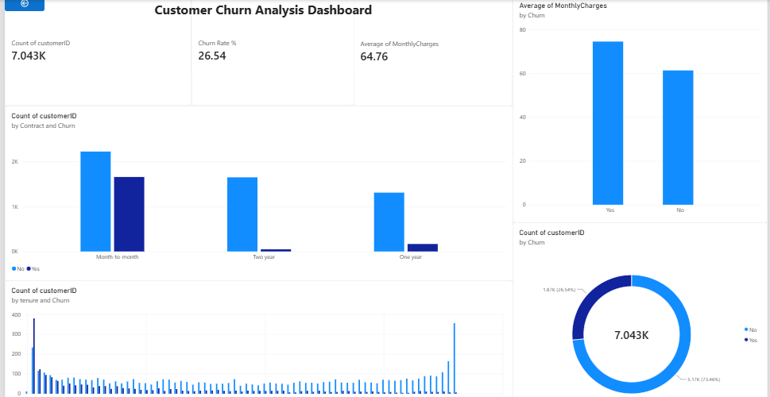

      
# Customer Churn Analysis Dashboard

End-to-end data analysis project identifying key drivers of customer churn using SQL, Python, and Power BI.

## Overview
Analyzed 7,043 telecom customer records to understand why customers leave and identify the highest-risk segments — using SQL for data cleaning and querying, Python for exploratory analysis and visualization, and Power BI for an interactive dashboard.

## Tools Used
SQL (MySQL), Python (Pandas, Matplotlib, Seaborn), Power BI, AI-assisted analysis (ChatGPT/Claude)

## Key Findings

1. **Overall churn rate:** 26.54% of customers churned (1,869 out of 7,043)

2. **Contract type is the strongest churn driver:** Month-to-month customers churn at 42.71%, compared to 11.27% for one-year contracts and just 2.83% for two-year contracts — a 15x difference

3. **Churned customers pay more:** Average monthly charge for churned customers is ₹74.44 vs ₹61.27 for retained customers

4. **New customers are highest risk:** 47.44% churn within the first year, dropping to 9.51% after 4+ years of tenure

## Data Cleaning
Identified and resolved 11 records with missing billing data, caused by customers with zero tenure who had not yet been billed — validated and corrected in both SQL and Python.

## Dashboard

The Power BI dashboard includes:
- KPI cards: Total Customers, Churn Rate %, Average Monthly Charges
- Churn by Contract Type
- Churn by Tenure
- Average Monthly Charges by Churn
- Overall Churn Split (donut chart)

## Files
- `churn_analysis.sql` — SQL queries for data cleaning and analysis
- `churn_analysis.ipynb` — Python notebook with data cleaning and visualizations
- `customer_churn_dashboard.pbix` — Power BI dashboard file
- `dashboard_screenshot.png` — Dashboard preview image

## Key Insight
New, month-to-month customers paying higher rates represent the company's highest churn-risk segment — suggesting contract incentives targeted at new customers could meaningfully reduce churn.
